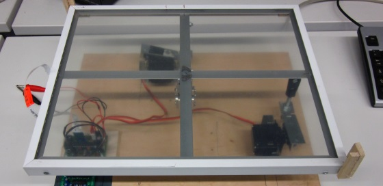

Ergebnis
--------

### Ergebnis

Obwohl der Roboter für die Wanderkennung jedes Feld des Labyrinths ansteuern muss, braucht die Erkennung des gesamten Labyrinths (35 Felder) dank diverser Optimierungen lediglich etwas mehr als 10 Minuten. Zudem kann man das erkannte Labyrinth in einer Datei speichern und es zu einem späteren Zeitpunkt lösen lassen.

### Probleme

Probleme aufzählen.

### Projektverlauf

- **Einarbeitung:** Vorgängercode und Funktionsfähigkeit des Roboters testen.
- **Durchlaufen des Labyrinths:** Durch Vorgabe eines Labyrinths als Datenstruktur soll die Kugel einen beliebig vorgegebenen Pfad durchlaufen können. Ferner wird ein optimaler Weg durch das Labyrinth berechnet.
- **Erkennen des Labyrinths:** Durch Ablaufen eines realen Labyrinths soll die Struktur des Labyrinths erkannt und abgespeichert werden. Dafür wird ein Algorithmus entworfen und implementiert.
- **Fertigstellung:** Präsentation, Poster und Webseite fertig stellen; ggf. eine grafische Oberfläche erstellen.

### Ausblick

Der Roboter lässt sich (bezogen auf unsere Aufgabenstellung) nicht wesentlich verbessern. Mögliche Erweiterungen:

* GUI schreiben
* Labyrinthmaße experimentell bestimmen lassen
* Unregelmäßige Labyrinthe zulassen
* Hardware erneuern und optimieren

### Downloads

* [Poster](downloads/poster.pdf)
* [Quellcode](downloads/wegflaby_ap.zip)
* [GitHub Projektseite](https://github.com/flo7210/WegfLaby_AP)