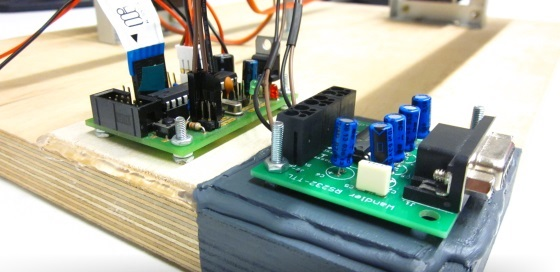

Kommunikationsprotokoll
-----------------------



### Modell
 
Das Protokoll ist asymmetrisch und umfasst zwei Teilnehmer, nämlich den Mikrocontroller und die [`Balancer`-Klasse](referenz.html#h2-class-balancer-balancer). Wir nehmen an, dass der Kommunikationskanal frei von Fehlern ist. `Balancer` übergibt die *Befehle* und der Mikrocontroller gibt *Antworten*.

### Antworten

*Antworten* bestehen aus genau acht Zeichen. Der Mikrocontroller wird beim Balancieren der Kugel maximal 60 mal pro Sekunde die aktuelle Position der Kugel als Antwort der folgenden Form geben:

```ini
[sign][x-coord],[y-coord]
```

`[x-coord]` und `[y-coord]` sind dreistellige Zahlen zwischen `025` und `555`, die die Koordinaten der Kugel entspricht. `[sign]` ist von der folgenden Form:

- `=`, wenn die Kugel sich balanciert hat.
- `:`, sonst.

**Bemerkung:** Hat sich die Kugel balanciert, so muss die Kugel nicht notwendigerweise am Zielpunkt sein. Ungültige Kugelkoordinaten, d.h. Koordinaten, die stark von den vorherigen abweichen, werden nicht zurückgegeben.

### Kommentare

Kommentare können in den Antwortenstream eingebunden werden. Taucht das Zeichen `#` auf, so werden dieses und die sieben Zeichen danach von der Interpretation ausgeschlossen.

### Befehle

Ist die Kugel balanciert, so wird der Mikrocontroller auf ein Befehl warten. Ein *Befehl* ist genau acht Zeichen lang und hat die folgende Form:

```ini
[sign][x-coord],[y-coord]
```

`[x-coord]` und `[y-coord]` entsprechen die Koordinaten, die die Kugel ansteuern soll. `[sign]` ist von der folgenden Form:
- `!`, wenn die Servomotoren des Touchscreens auf den Anfangswerten zurückgesetzt werden sollen.
- `.`, sonst.

**Bemerkung:** Der Befehl wird nur dann vom Mikrocontroller angenommen, wenn die Kugel balanciert ist. Befehle können keine Kommentare sein.