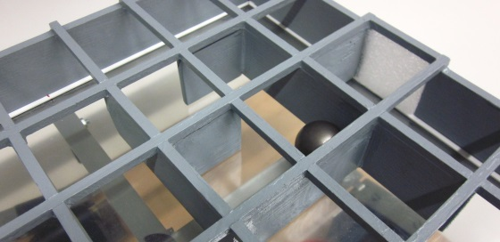
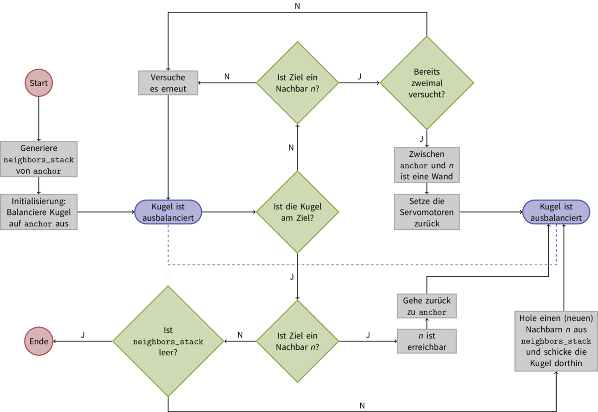

Labyrintherkennung
------------------

### Einleitung

Beim Erkennen des Labyrinths besteht die Herausforderung im Wesentlichen aus der *(lokalen) Wanderkennung*: Für ein Feld soll überprüft werden, ob die benachbarten Felder mit der Kugel erreichbar sind. Die Labyrintherkennung ist schließlich eine Iteration über die Wanderkennung bei jedem Feld.

Im Anschluss ist das Lösen des Labyrinths lediglich eine [Breitensuche](#h3-bfs-start-end-).

### Wanderkennung

Das folgende Flowchart stellt die Wanderkennung für ein bestimmtes Feld `anchor` im Labyrinth dar. Dabei enthält `neighbors_stack` alle benachbarten Felder von `anchor`, deren lokale Wanderkennung noch aussteht.

### Festhalten des Fortschritts

Der Roboter fängt mit der Labyrintherkennung bei einem beliebigen Feld an. Nach der Wanderkennung beim Anfangsfeld erhalten wir dessen erreichbare benachbarten Felder und speichern davon diejenigen Felder in einem globalen Stack, deren Wanderkennung noch aussteht. Es wird ein Feld aus dem Stack gewählt und entfernt. Nun wird die Kugel per [`run`-Funktion](referenz.html#h3-run-path-maze-) zum gewählten Feld geschickt und die ganze Prozedur solange wiederholt bis der Stack leer ist.

### Optimierungen

- Die Wanderkennung bei einem Punkt lässt die Kugel auf dem letzten überprüften Feld, falls dieses erreichbar war. Somit spart man sich ein unnötiges Zurückgehen zum Anker.
- Falls die Kugel am Ende der Wanderkennung auf einem Nachbarfeld gelassen wurde, wird dieser bei der Wahl aus dem Stack bevorzugt.