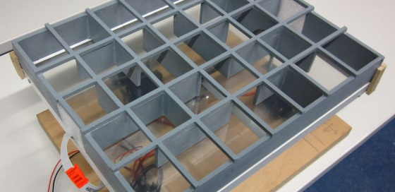
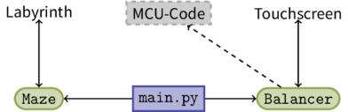

Überblick
---------



### Aufgabenstellung

Ein bereits vorhandener Roboter mit neigbarem Touchscreen soll etwas Neues lernen: Er soll ein beliebiges auf dem Rahmen seines Touchscreens aufliegendes Labyrinth (vorgegebener Rastergröße) mithilfe einer Metallkugel einlesen können. Der Roboter kann eine solche Kugel bereits auf eine ihm vorgegebene Richtung durch Kippen rollen lassen und sie balancieren, so dass die Kugel stillsteht. Das Ziel ist es somit, den Roboter ein zuvor eingelesenes Labyrinth mit der Kugel (auf optimalem Weg) lösen zu lassen.

### Vereinfachungen

Wir haben zunächst ein paar vereinfachende Voraussetzungen getroffen:

- Das Labyrinth soll rechteckig und *gleichmäßig* sein, z.B:

  ```ini
                      +--+--+--+--+--+--+--+
                      |     |              |
                      +  +--+  +  +  +--+  +
                      |     |  |  |  |     |
                      +  +  +  +  +--+  +--+
                      |  |     |  |        |
                      +--+--+--+--+--+--+--+
  ```
- Die Maße des Labyrinths soll bekannt sein.

### Code-Aufteilung

Der Roboter, auf dem unsere Aufgabenstellung aufbaut, wird alleine durch den Mikrocontroller (MCU) gesteuert. Wir hingegen haben die Labyrintherkennungs- und Lösungslogik auf dem Computer entwickelt. Wir haben uns für [Python 2.7](http://python.org) entschieden.

Unser Quellcode ist in drei Teile aufgeteilt:



1. Die `Maze`-Klasse ist eine Datenstruktur zur Speicherung des Labyrinths im Form eines einfachen Graphens.
2. Die `Balancer`-Klasse ist speziell für die Kommunikation zwischen dem Computer und dem Touchscreen (Mikrocontroller) verantwortlich.
3. Die Logik für die Labyrintherkennung befindet sich in `main.py`, das beide Klassen verbindet.

Über uns
--------

* [Florian Nowak](https://github.com/flo7210): B.Sc. Mathematik, 7. Fachsemester
* [Yichuan Shen](https://github.com/yishn): M.Sc. Mathematik, 1. Fachsemester

**Betreuer:** Gero Plettenberg, **Supervisor:** Thomas Kloepfer